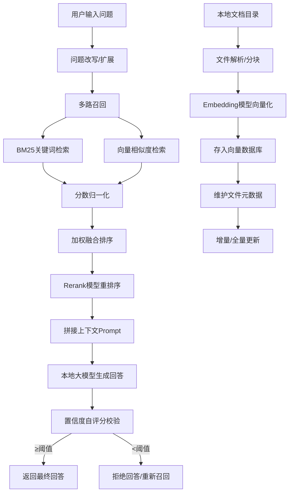

# 高质量本地RAG Agent 分步实现路线图
这是一份可直接落地的、从0到1的项目实现路线图，完全贴合你课上的设计思路，按阶段拆解任务，方便你按步骤推进、随时记录。

---

## 🎯 项目核心目标
实现一个**本地目录专属问答Agent**，支持：
- 本地文档（文本/Markdown/图片）知识库构建
- 多路召回（BM25+向量检索）+ 混合排序
- 本地大模型（含Embedding/Rerank）无API依赖运行
- 全量/增量更新知识库，回答带置信度校验

---

## 📦 技术栈清单（核心依赖）
| 模块          | 推荐选型                                                | 用途                                 |
| :------------ | :------------------------------------------------------ | :----------------------------------- |
| 文件解析      | `python-docx`/`PyPDF2`/`unstructured`                   | 解析文本、PDF、Markdown、图片（OCR） |
| 文本分块      | LangChain `RecursiveCharacterTextSplitter`              | 文档分块，生成Chunk                  |
| 向量数据库    | Chroma / FAISS                                          | 本地存储向量，无额外服务依赖         |
| Embedding模型 | `sentence-transformers` (本地) / OpenAI Embedding (API) | 文本向量化                           |
| 多路召回      | BM25 (`rank_bm25`) + 向量检索                           | 关键词+语义混合召回                  |
| 融合排序      | 归一化 + 加权融合                                       | 合并两路召回结果                     |
| Rerank模型    | `bge-reranker-base`                                     | 重排序提升相关性                     |
| 本地大模型    | Ollama (qwen/llama2) / 开源轻量模型                     | 生成回答，置信度自评分               |
| 交互界面      | 命令行（初期）/ Gradio/Streamlit（后期）                | 用户问答入口                         |

---

## 🚀 分阶段实现路线（MVP → 完整功能）

### 阶段1：核心MVP（1-2天，跑通基础流程）
目标：实现「文本知识库 + 向量检索 + 本地模型问答」的最简闭环
1.  **文件读取与解析**
    - 支持Markdown、纯文本文件读取
    - 编写简单的目录遍历脚本，递归读取所有文档
2.  **文本分块与向量化**
    - 使用LangChain分块器设置Chunk大小（推荐512-1024）
    - 接入本地Embedding模型，生成向量
    - 存入本地向量数据库（Chroma/FAISS）
3.  **基础向量检索问答**
    - 实现用户问题Embedding + 向量检索TopK
    - 拼接RAG Prompt，调用本地Ollama模型生成回答
    - 命令行交互，输入问题返回结果

---

### 阶段2：多路召回与混合检索（1-2天，核心功能落地）
目标：实现「BM25 + 向量检索」双路召回，解决单一检索的局限性
1.  **BM25关键词检索实现**
    - 对所有Chunk文本建立BM25索引
    - 实现用户问题的关键词检索，返回TopK结果
2.  **两路结果归一化与加权融合**
    - 分别获取BM25分数和向量相似度分数
    - 实现Min-Max归一化，将分数缩放到0-1区间
    - 设置权重（如`0.3*BM25 + 0.7*向量`）计算融合分数
    - 按融合分数排序，返回最终TopK文档
3.  **Rerank模型重排序（可选）**
    - 接入`bge-reranker`模型，对融合后的结果做二次排序
    - 进一步提升结果相关性

---

### 阶段3：知识库更新与多模态扩展（1-2天，解决痛点）
目标：实现全量/增量更新，支持多模态数据
1.  **增量更新逻辑实现**
    - 维护文件元数据JSON（路径、修改时间、哈希值）
    - 每次运行对比文件状态：
      - 新增/修改文件：重新解析、分块、向量化
      - 未修改文件：跳过处理
      - 删除文件：提示用户需全量更新
2.  **全量更新兜底**
    - 实现一键清空向量库、重新初始化功能
3.  **多模态支持（图片/视频，可选）**
    - 图片：用OCR提取文本，按文本流程处理
    - 视频：抽帧+OCR/图像理解，提取关键文本内容

---

### 阶段4：质量优化与置信度校验（1天，提升回答质量）
目标：解决幻觉问题，增加回答可信度
1.  **问题改写/扩展**
    - 用本地模型对用户问题进行扩写/改写，生成多个查询提升召回
2.  **回答置信度自评分**
    - 设计Prompt让模型对回答与上下文的相关性打分（0-10分）
    - 低于阈值（如6分）拒绝回答或重新召回
3.  **Prompt优化**
    - 完善RAG Prompt模板，减少模型幻觉
    - 明确模型角色、回答规则、引用来源要求

---

### 阶段5：开源准备与用户体验优化（1-2天，可直接发布到GitHub）
目标：让其他用户拿到就能跑，提升项目吸引力
1.  **配置文件与参数化**
    - 编写`config.ini`，支持用户自定义目录、API Key、模型参数
    - 命令行参数支持：`--init`初始化、`--chat`问答、`--update`更新
2.  **依赖与环境准备**
    - 编写`requirements.txt`，一键安装所有依赖
    - 编写详细的`README.md`：安装步骤、配置说明、使用示例、常见问题
3.  **可选：简易Web界面**
    - 用Gradio/Streamlit搭建极简Web界面，用户体验更好

---

## 📌 关键功能优先级与避坑指南
| 功能                | 优先级 | 说明                        |
| :------------------ | :----- | :-------------------------- |
| 文本+向量检索MVP    | ★★★★★  | 必须先跑通，再做扩展        |
| BM25+混合检索       | ★★★★☆  | 核心提升，是项目亮点        |
| 增量更新            | ★★★★☆  | 解决Token浪费和重复处理问题 |
| Rerank重排序        | ★★★☆☆  | 锦上添花，可后期加上        |
| 多模态（图片/视频） | ★★☆☆☆  | 难度较高，初期可先不做      |
| Web界面             | ★★☆☆☆  | 不影响核心功能，后期再做    |

### 避坑要点
1.  **先做文本，再碰多模态**：多模态解析会引入大量复杂度，初期卡住会打击信心
2.  **模型选择从轻到重**：优先用轻量本地模型，跑通后再换更大模型
3.  **Chunk大小与TopK平衡**：Chunk过小会丢失上下文，过大则稀释语义，可多组测试找最优值
4.  **归一化是关键**：不做归一化直接加权，会导致一路检索结果被完全淹没

---

## 📚 附：核心流程示意图（文字版）

---

## 💡 下一步行动建议
1.  先按「阶段1」的步骤，搭一个最简的向量检索+本地模型问答版本，跑通流程
2.  再逐步叠加多路召回、增量更新等功能，每一步都能看到效果，不会中途卡壳
3.  所有代码按功能分模块写，方便后期维护和扩展

需要我帮你把某个阶段的核心代码（比如文件读取+分块、向量检索、增量更新）写成可直接复制的Python模板吗？